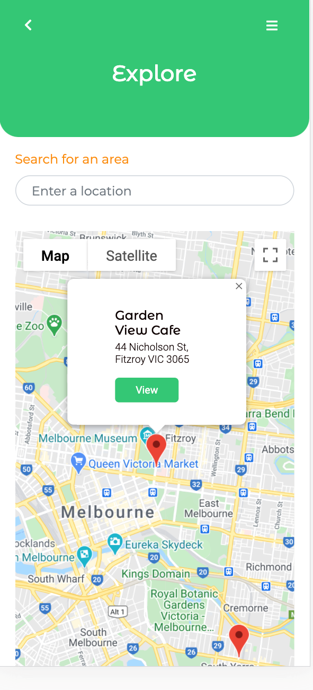
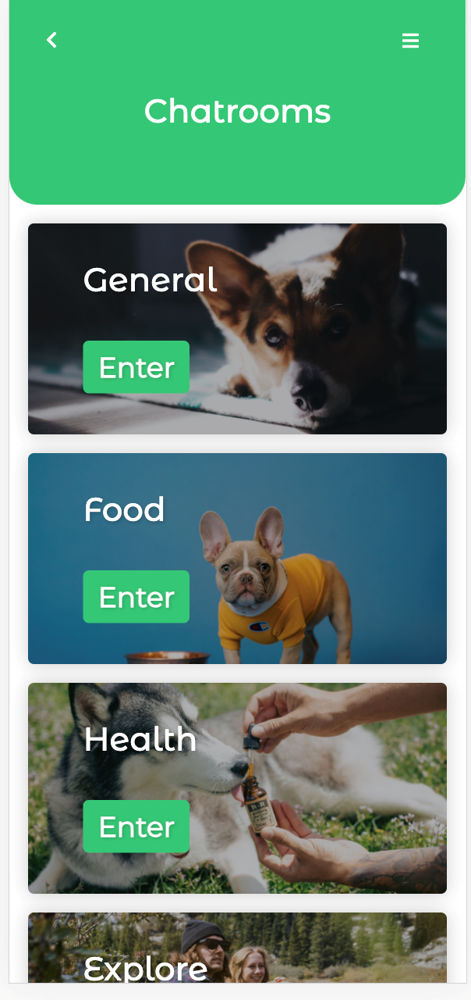
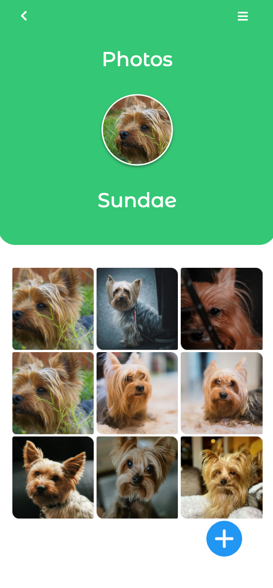
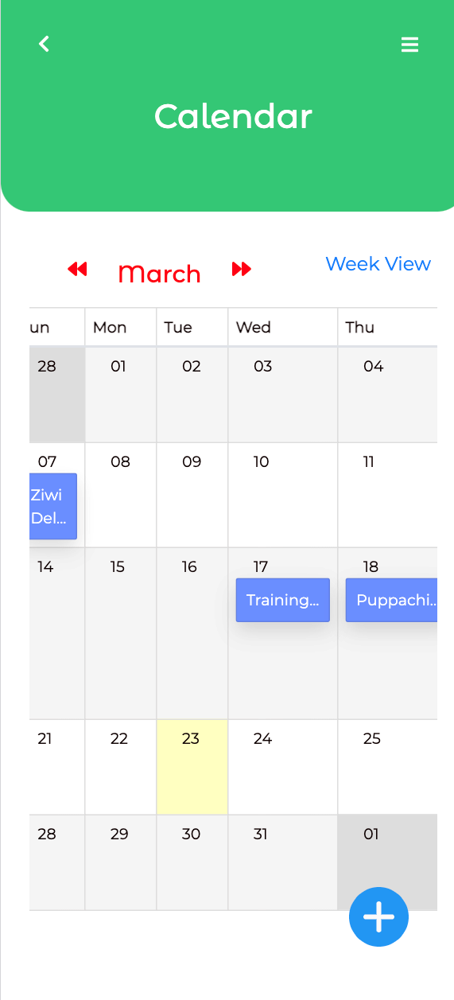
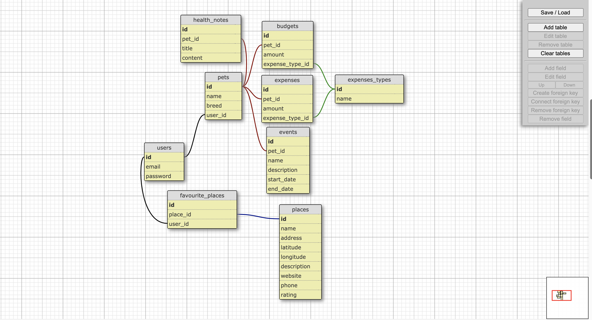

<p align="center"></p>
<h1 align="center">BestieLife</h1>
<h3 align="center">Live at :zap: <a href="bestielife.com.au">BestieLife</a></h4>
<h4 align="center">Built by pet lovers for pet lovers.:heart:</h4>
<br />

<p align="center">
  <a href="#features">Features</a> •
  <a href="#tech-stack">Tech Stack</a> •
  <a href="#how-to-use">How To Use</a> •
  <a href="#database-design">Database Design</a> •
  <a href="#license">License</a>
</p>
<br />

<div align="center">
  
  
  
  
</div>

<br />

## Tech Stack

* Javascript
* Ruby on Rails
* PostGreSQL

<br />

## Features

* Make note of important events in your pet's life
* Expense and budget tracking
* Explore pet-friendly restaurants/cafe 
* Chat with friends !!!
* Pet Insta !! 

<br />

## How To Use

To clone and run this application, you'll need [Git](https://git-scm.com) and [Node.js](https://nodejs.org/en/download/) (which comes with [npm](http://npmjs.com)) installed on your computer. From your command line:

```bash
# Clone this repository
$ git clone https://github.com/appu4ever/bestielife

# Go into the repository folder
$ cd bestielife

# Check your Ruby version
$ ruby -v
```
The ouput should start with something like `ruby 2.5.1`
If not, install the right ruby version using [rbenv][rbenv_site] (it could take a while):

```bash
$ rbenv install 2.5.1
```

### Install dependencies

Using [Bundler](https://github.com/bundler/bundler) and [Yarn](https://github.com/yarnpkg/yarn):

```bash
$ bundle && yarn

# Initialize the database
$ rails db:create db:migrate db:seed

# Serve
$ rails s


```

<br />

## Database Design



<br />

## License

MIT

---
> GitHub [@appu4ever](https://github.com/appu4ever) &nbsp;&middot;&nbsp;
